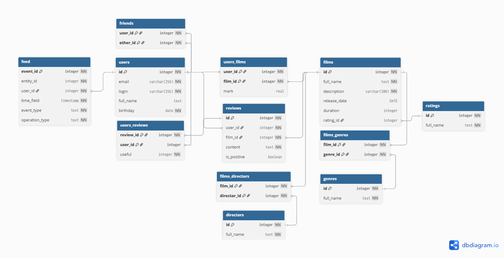

# Структура БД приложения



* Схема БД с использованием [инструмента](https://dbdiagram.io/d/Jajava-filmorate-683dc11961dc3bf08d2ab823)
* Скрипт развертывания схемы в БД (`PostgreSQL` v.16.9) доступен по [ссылке](docs/pgsql_scheme.sql)
* Скрипт развёртывания схемы в БД (`H2`) доступен по [ссылке](docs/h2_scheme.sql)
* Подробное описание таблиц доступно по [ссылке](docs/scheme.md)

# Примеры запросов к таблицам

## Пользователи

* Получить список 10 пользователей:
  `UserController.findAll(@RequestParam(defaultValue = "100") int size, @RequestParam(defaultValue = "0") int from)`
  ```sql
  SELECT u.ID,
         u.EMAIL,
         u.LOGIN,
         u.FULL_NAME,
         u.BIRTHDAY
    FROM users u
   LIMIT 100 /* size*/
  OFFSET 0 /* from */;
  ```

* Получить пользователя по идентификатору : `UserController.findById(@PathVariable Long id)`
  ```sql
  SELECT u.ID,
         u.EMAIL,
         u.LOGIN,
         u.FULL_NAME,
         u.BIRTHDAY
    FROM USERS u
   WHERE u.ID = 1 /* id */
  ```

* Получить список друзей пользователя: `UserController.findFriends(@PathVariable Long userId)`
  ```sql
  SELECT u.ID,
         u.EMAIL,
         u.LOGIN,
         u.FULL_NAME,
         u.BIRTHDAY
    FROM USERS_RELATIONSHIPS ur
   INNER JOIN RELATIONSHIPS r ON ur.RELATIONSHIP_ID = r.ID
   INNER JOIN RELATIONSHIP_ATTRIBUTES rat ON r.TYPE_ID = rat.ID
   INNER JOIN USERS_RELATIONSHIPS ur2 ON r.ID = ur2.RELATIONSHIP_ID
   INNER JOIN USERS u ON ur2.USER_ID = u.ID
   WHERE ur.ID = 1 /* userId */
     AND rat.ID = 4 /* Дружба */
     AND ur2.USER_ID != ur.ID;
  ```

* Получить список общих друзей пользователей:
  `UserController.findCommonFriends(@PathVariable Long userId, @PathVariable Long otherId)`
  ```sql
  WITH first_user_friends AS
  (SELECT u.ID,
          u.EMAIL,
          u.LOGIN,
          u.FULL_NAME,
          u.BIRTHDAY
     FROM USERS_RELATIONSHIPS ur
    INNER JOIN RELATIONSHIPS r ON ur.RELATIONSHIP_ID = r.ID
    INNER JOIN RELATIONSHIP_ATTRIBUTES rat ON r.TYPE_ID = rat.ID
    INNER JOIN USERS_RELATIONSHIPS ur2 ON r.ID = ur2.RELATIONSHIP_ID
    INNER JOIN USERS u ON ur2.USER_ID = u.ID
    WHERE ur.ID = 1 /* userId */
      AND rat.ID = 4 /* Дружба */
      AND ur2.USER_ID != ur.ID),
  second_user_friends AS
  (SELECT u.ID,
          u.EMAIL,
          u.LOGIN,
          u.FULL_NAME,
          u.BIRTHDAY
     FROM USERS_RELATIONSHIPS ur
    INNER JOIN RELATIONSHIPS r ON ur.RELATIONSHIP_ID = r.ID
    INNER JOIN RELATIONSHIP_ATTRIBUTES rat ON r.TYPE_ID = rat.ID
    INNER JOIN USERS_RELATIONSHIPS ur2 ON r.ID = ur2.RELATIONSHIP_ID
    INNER JOIN USERS u ON ur2.USER_ID = u.ID
    WHERE ur.ID = 1 /* otherId */
     AND rat.ID = 4 /* Дружба */
     AND ur2.USER_ID != ur.ID)
  SELECT fuf.ID,
         fuf.EMAIL,
         fuf.LOGIN,
         fuf.FULL_NAME,
         fuf.BIRTHDAY
    FROM first_user_friends fuf
  INTERSECT
  SELECT suf.ID,
         suf.EMAIL,
         suf.LOGIN,
         suf.FULL_NAME,
         suf.BIRTHDAY
    FROM second_user_friends suf;
  ```

* Создание пользователя: `UserController.create(@RequestBody User user)`
  ```sql
  INSERT INTO users (email, login, full_name, birthday)
  VALUES ('a@a.ru', 'a', NULL, to_date('01.01.2000', 'dd.mm.yyyy')) RETURNING id;
  ```

* Обновление пользователя: `UserController.update(@RequestBody User newUser)`
  ```sql
  UPDATE users
     SET email = 'a@b.ru',
         login = 'aa',
         full_name = 'Aa',
         birthday = TO_DATE('02.01.2000', 'dd.mm.yyyy')
   WHERE id = 1 /* id */;
  ```

* Добавление дружбы: `UserController.addFriend(@PathVariable Long id, @PathVariable Long friendId)`

Примечание: Бизнес-логика по проверке наличия запросов от одного пользователя другому, а так же изменение статуса дружбы
будет реализована на уровне приложения. Так же на уровне приложения в ходе работы алгоритмов будет получен идентификатор
общих отношений с типом `Дружба` и созданы/изменены необходимые записи в таблицах `relationships` и
`users_relationships` для обоих пользователей

* Удаление дружбы: `UserController.removeFriend(@PathVariable Long id, @PathVariable Long friendId)`

Примечание: Бизнес-логика по проверке наличия дружбы между пользователями, а так же изменение статуса дружбы будет
реализовано на уровне приложения. Так же на уровне приложения в ходе работы алгоритмов будет получен идентификатор общих
отношений с типом `Дружба` и при его наличии будут удалены/изменены необходимые записи в таблицах `relationships` и
`users_relationships` для обоих пользователей

* Удаление пользователя по идентификатору: `UserController.deleteUser(@PathVariable Long id)`
  ```sql
  DELETE FROM users
   WHERE id = 1 /* id */;
  ```

* Очистка таблицы пользователей: `UserController.clearUsers()`
  ```sql
  DELETE FROM users;
  ```

## Фильмы

* Получить список 10 фильмов:
  `FilmController.findAll(@RequestParam(name = "size", defaultValue = "100") int size, @RequestParam(name = "from", defaultValue = "0") int from)`
  ```sql
  SELECT fi.id,
         fi.full_name,
         fi.description,
         fi.duration,
         fi.release_date,
         r.full_name AS rating_name
    FROM films fi
    LEFT JOIN ratings r
      ON fi.rating_id = r.id
   LIMIT 100 /* size */
  OFFSET 0 /* from */;
  ```

* Получить фильм по идентификатору: `FilmController.findById(@PathVariable Long id)`
  ```sql
  SELECT fi.id,
         fi.full_name,
         fi.description,
         fi.duration,
         fi.release_date,
         r.full_name AS rating_name
    FROM films fi
    LEFT JOIN ratings r
      ON fi.rating_id = r.id
   WHERE fi.id = 1 /* id */;
  ```

* Получить список самых популярных фильмов:
  `FilmController.findPopular(@RequestParam(required = false, defaultValue = "10") Integer count)`
  ```sql
  SELECT fi.id,
         fi.full_name,
         fi.description,
         fi.duration,
         fi.release_date,
         r.full_name  AS rating_name,
         COUNT(uf.id) AS total_likes
    FROM films fi
    LEFT JOIN ratings r
      ON fi.rating_id = r.id
   INNER JOIN users_films uf
      ON fi.id = uf.film_id
   GROUP BY fi.id,
            fi.full_name,
            fi.description,
            fi.duration,
            fi.release_date,
            r.full_name
   ORDER BY 7 DESC
   LIMIT 10 /* count */;
  ```

* Добавление фильма: `FilmController.create(@RequestBody Film film)`
  ```sql
  INSERT INTO films (full_name, description)
  VALUES ('А', 'Остросюжетный фильм про приключения А') RETURNING id;
  ```

* Обновление фильма: `FilmController.update(@RequestBody Film film)`
  ```sql
  UPDATE films
     SET full_name = 'Б',
         description = 'Не очень интересный фильм про Б'
   WHERE id = 1 /* id */;
  ```

* Добавление лайка фильму: `FilmController.addLike(@PathVariable(name = "id") Long filmId, @PathVariable Long userId)`

Примечание: Бизнес-логика по проверке наличия лайков пользователя фильму, а так же добавление лайка при его отсутствии
будет реализована на уровне приложения. Так же на уровне приложения в ходе работы будут созданы/проигнорированы
необходимые записи в таблице `users_films`

* Удаление лайка с фильма:
  `FilmController.removeLike(@PathVariable(name = "id") Long filmId, @PathVariable Long userId)`

Примечание: Бизнес-логика по проверке наличия лайков пользователя фильму, а так же удаление лайка при его наличии
будет реализована на уровне приложения. Так же на уровне приложения в ходе работы будут удалены
необходимые записи в таблице `users_films`

* Удаление фильма по идентификатору: `FilmController.deleteFilm(@PathVariable(name = "id") Long filmId)`
  ```sql
  DELETE FROM films
   WHERE id = 1 /* id */;
  ```

* Очистка таблицы пользователей: `FilmController.clearFilms()`
  ```sql
  DELETE FROM films;
  ```